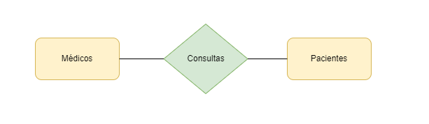
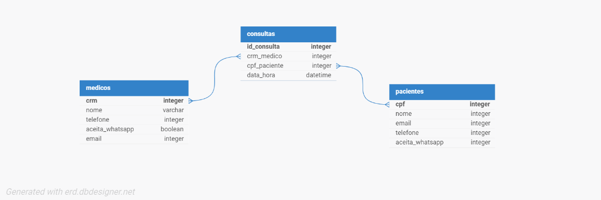

# Modelagem de Dados com SQL

## Introdução

SQL (Structured Query Language) é uma linguagem de consulta estruturada utilizada para manipular e gerenciar bancos de dados relacionais. Com SQL, podemos criar, modificar e consultar tabelas, bem como inserir, atualizar e excluir dados de um banco de dados.

## Modelagem de Dados Conceitual

A modelagem de dados é o processo de representar a estrutura e o relacionamento dos dados em um sistema de informação. Existem três níveis de modelagem de dados: conceitual, lógico e físico.

A modelagem de dados conceitual é o nível mais alto de abstração e descreve as entidades, atributos e relacionamentos de um sistema de informação sem se preocupar com detalhes de implementação. Neste nível, utilizamos diagramas de entidade-relacionamento (DER) para representar a estrutura dos dados.

## Modelagem de Dados Lógica

A modelagem de dados lógica é o nível intermediário de abstração e descreve como os dados são armazenados e organizados em um banco de dados. Neste nível, utilizamos modelos de dados como o modelo relacional para representar a estrutura dos dados.

## Modelagem de Dados Física

A modelagem de dados física é o nível mais baixo de abstração e descreve como os dados são armazenados em um dispositivo de armazenamento físico, como um disco rígido. Neste nível, consideramos detalhes de implementação como índices, partições e otimizações de desempenho.

## Conclusão

A modelagem de dados é um processo fundamental no desenvolvimento de sistemas de informação e bancos de dados. Com a modelagem de dados, podemos representar a estrutura e o relacionamento dos dados de forma clara e organizada, facilitando o desenvolvimento, manutenção e consulta de sistemas de informação.